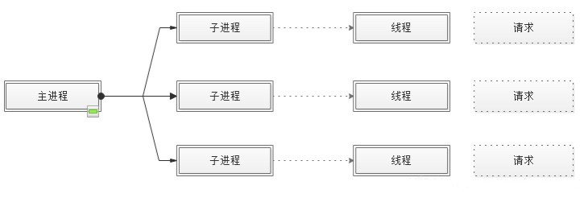
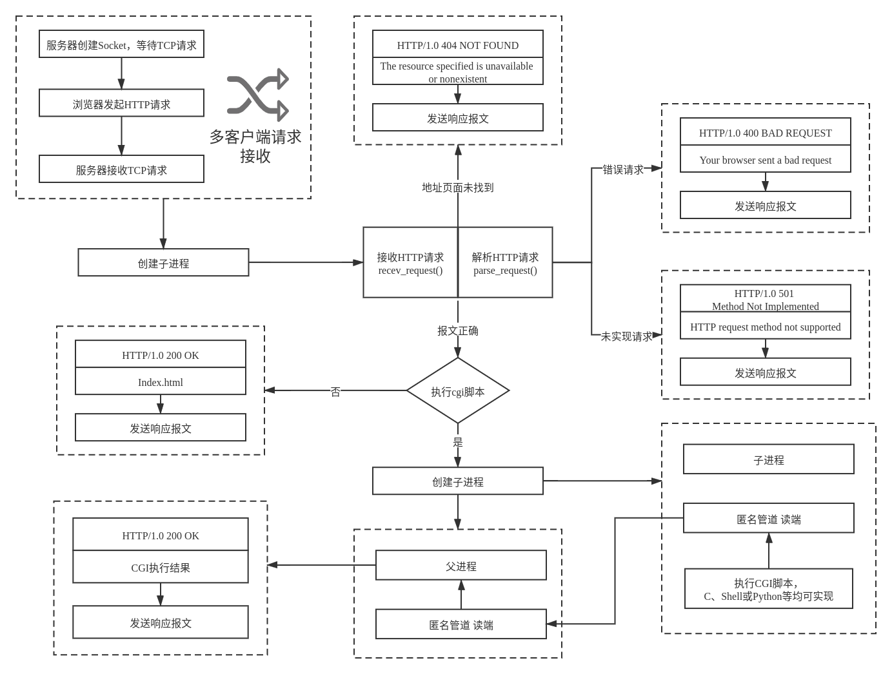
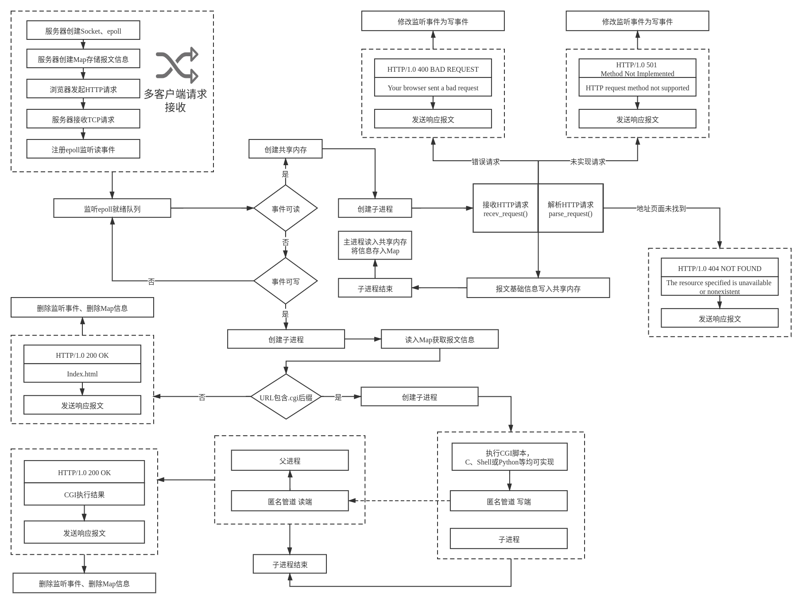

# TinyHttpd-Rebuild

## 简介

Tinyhttpd 是J. David Blackstone在1999年写的不到 500 行的超轻量型 Http Server，实现最基本的Httpd功能，其编程语言为C语言，官网地址为:[http://tinyhttpd.sourceforge.net](http://tinyhttpd.sourceforge.net/)。

TinyHttpd-Rebuild是在此基础上使用C++语言结合所学知识进行的改写重构版本。


## 功能

本次Rebuild实现了2个版本：

- 版本一（master分支）：在原项目框架下做了部分修改，源文件代码量约500行，实现功能：
  - 多进程；
  - 进程间通信：匿名管道；
  - PUT、GET请求识别；
  - 根据URL返回不同前端页面（HTML或CGI）；
  - 4xx，5xx状态码。

- 版本二（epoll分支）：在版本一的基础上添加了一些小尝试，源文件代码量约700行，实现功能：
  - 多进程；
  - 进程间通信：匿名管道、共享内存；
  - 非阻塞式socket网络通信；
  - IO多路复用epoll方法；
  - PUT、GET请求识别；
  - 根据URL返回不同前端页面（HTML或CGI）；
  - 4xx，5xx状态码。


## 与原版的差异

- 由“多线程+多进程”改为“多进程”；
  - 原项目的工作模式：（1）主线程中，创建子线程接收客户端请求；（2）子线程中，开启子进程处理客户端请求。
    这样的行为模式可能导致在子进程中除调用线程外的其它线程全都终止执行并消失，因此在多线程的情况下**存在造成死锁和内存泄露的可能性**。
  - 本项目的工作模式：多进程I/O模型，每个进程响应一个请求。
    参考了apache服务器MPM (multi-processing module)工作模式中的**prefork**模式，也是CentOS 7的默认模型。



- （epoll分支）添加epoll方式增强高并发情况下服务器性能；
- （epoll分支）socket设置为非阻塞；
- （epoll分支）增加进程间通信方式：共享内存；
- （后期计划尝试实现HTTP1.1的长连接）


## 编译运行

本项目基于cmake实现，故在项目根目录输入如下指令即可完成编译生成二进制文件

```shell
# 编译
cmake .
make
# 运行
# 若报错请事先创建/bin文件夹
# 使用命令 mkdir ./bin
cd ./bin
./MyHttpd
```

### 注意事项

若想调试获取代码的运行输出：

- 对于`httpd_handler`，请在CMake文件`set(CMAKE_CXX_FLAGS xxx)`一行添加`-D DEBUG`
- 对于`httpd`，请在CMake文件`set(CMAKE_CXX_FLAGS xxx)`一行添加`-D CHECK`


## 文件目录

```
├── bin							# 二进制可执行文件目录				
│   └── MyHttpd
├── CMakeLists.txt				# CMake文件
├── htdocs						# 前端文件存放目录
│   ├── index.html
│   └── test.cgi
├── include						# 头文件目录
│   ├── httpd.h
│   └── httpd_handler.h
├── src							# 源文件目录
│   ├── httpd.cpp
│   ├── httpd_handler.cpp
│   └── main.cpp
├── pic							# 说明文档图片
│   ├── 2.png
│   ├── epoll.png
│   └── master.png
├── README.md					# 说明文档
```


## 工作流程
若图片无法正常显示请先修改Hosts或挂梯子
### master分支

master分支的流程如下：

- 服务器主进程监听连接；
- 客户端连接，服务器`fork()`创建子进程；
- 子进程接收Http报文并解析报文；
- 报文违法则发送包含错误状态码的报文；
- 报文合法：
  - url不包含.cgi，则返回默认的index.html前端页面
  - url包含.cgi，则再`fork()`创建子进程，子进程执行CGI脚本，通过匿名管道传递给“父进程”，“父进程”再返回结果给客户端。



### epoll分支

epoll分支的流程如下：

- 服务器创建Map存储报文信息；
- 服务器创建epoll；

- 服务器监听epoll的ready队列；
  - （这一步流程图有所简略）如果文件描述符是服务器socket，则`accept()`创建连接并获取客户端socket，对客户端socket注册监听读事件；
  - 如果事件可读（读事件），创建子进程接收并解析报文。由于“写时复制”规则，子进程获取到的报文信息无法直接传递给父进程。故借由共享内存方式传递必要信息给父进程。然后将该事件的监听事件修改为写事件。
  - 如果事件可写（写事件），读入Map中的报文信息，根据URL采取相应的回应措施，和master分支基本一致，只是**由于还未加入长连接功能，故在完成写事件后，会删除该客户端的所有信息并断开连接**。




